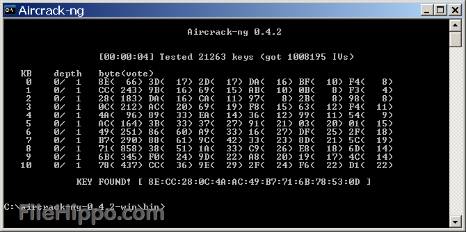

# Cracking WEP secured WiFi using Raspberry pis

In this workshop we’ll discuss and practise acquiring the PSK (pre-shared key) (Also known as the Wi-Fi password!) on a WEP secured network using nothing except a raspberry pi and a software suite known as Aircrack-NG.

### In this worksheet:

- What is WEP
- How our attack will work
- How to set up & carry out the attack
- Additional tasks

### What is WEP?
WEP (Wired Equivalent Privacy) is a security protocol for old WiFi networks. It basically meant that you had to have the wifi password so that you could join the network, but also that you couldn’t see what was being sent on the network without the password.

It works by combining a random number (The IV) and the key (your wifi password) to generate an RC4 keystream which encrypts whatever data you send. However if the same IV (random number) is used twice then it allows for the key to be recovered! This repetition is very likely as the IV is typically only 24 bits long and we can tell when it repeats because it isn’t encrypted when it’s sent!

If we capture enough IV’s, then the key can be recovered!

The tools we’ll need are:
- A software suite known as aircrack
- A Raspberry Pi
- A USB wifi antenna (or a flashed chip which will be on the Pi for this workshop)

### Let’s have a look

We’re going to have a look at what Wi-Fi networks are around us and what the Wi-Fi card can see by putting it into something called monitor mode. This mode just allows us to capture packets being sent by Wi-Fi networks without having to join them ourselves.

Firstly open a terminal on your Raspberry Pi.

And type in the following commands

- `sudo airmon-ng check kill`
- `nexutil -m2`
- `sudo airmon-ng start wlan0`

These commands check if there are any running programs that would cause interference, kill them and allow the Pi Wi-Fi chip “wlan0” to enter monitor mode

If the last commands worked okay, close that terminal window, open a new one and type the following command.

- `sudo airodump-ng start wlan0mon`

You should hopefully see a screen similar to the one above.

The person taking the course will tell you the name or “ESSID” of the router we’re trying to get the password of, try and fill in the table below using the information on your terminal screen.

| What you're finding                                    |what you found: |
| -------------------------------------------------------|:--------------:|
|ESSID (another name for the WiFi name)                  |                |
| BSSID (another name for MAC address)                   |                |
| ENC (encryption type)                                  |                |
|CH (Channel, the WiFi channel being used by that router)|                |

Check with the person taking the course once you’re done to make sure the information is correct or if you’re having any difficulty.

- Press Ctrl + C in the terminal window outputting information
- Open a new terminal window
- Here we’re going to use the information we acquired on the last page
- `sudo airodump-ng --bssid *BSSID* -c *Channel* -w WEPcrack wlan0mon`

Hopefully you should see a screen similar to the one left, only one router should be appearing at the top row.
Look at the “#Data” column, these are the IV’s we have to capture, More Iv’s means we have a better chance of cracking the password. To get more IV’s quicker we’re going to simulate traffic.

Open a new terminal window (don’t close any other terminal windows)

- `sudo aireplay-ng -3 -b *bssid* -h *mac address in station* wlan0mon`

Our attack captures genuine traffic and replays it to the router, the router replies and we capture it’s response to get another IV

**Once we have enough IV’s we can try to crack the password**

`sudo aircrack-ng WEPcrack-01.cap`

This program crawls through the captured data and finds IVs, once it has all the IVs it will try and compute the key through cryptographic analysis.

If there is enough information to extract the key the it will be output! If not it will automatically try again when more IV’s have been captured.

### What next?
- Can you connect to the wifi network with the key you’ve cracked?
- Can you see how many other devices are connected to the network
- Can you find out how WPA and WPA2 are immune from this style of attack
- How would a longer PSK affect the cracking time?
- What physical conditions would you change to affect the intercept rates, test them! Do your changes affect how quickly IV’s are captured?
