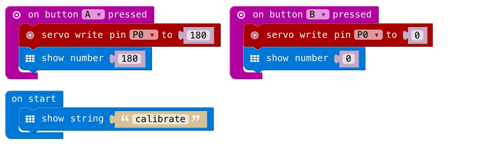

# Micro:bit Milk Monster

### In This Worksheet You Will…

Learn how to create a fully-functioning robot monster out of a milk carton, using a Micro:bit, a mini motor called a micro servo and some code so that when you shine a light on your moster it opens and closes its mouth.

### What You Will Need...

| item            | QTY | Item             | QTY | Item        | QTY |
| -------------   |:---:| -----------------|:---:|-------------|:---:|
| Milk carton     | 1   | Pen or Pencil    |1    | Scissors    |1    |
| Micro:bit       | 1   | Piece of String  |1    | Glue        |1    |
| Battery Pack    | 1   | Paper Clip       |1    | Tape        |1    |
| AAA Batteries   | 2   | Paper Template   |1    | Servo Mount |1    |
| Crocodile Clips | 3   | Micro-Servo Clip |1    |             |     |

### Getting Started…

First of all, we need to cut out the monster shape from our milk cartons. You will need a template and a pair of scissors. Remember, if you need any help just **ask a volunteer!**

First thing to do is stick the template to the carton so we know where to cut. Cut out your template and stick it to the front of your carton.

Cut around the template carefully, so you end up with a mouth-shaped hole with teeth.

Cut **only** the solid lines on the template and fold over to create a box, this will be the bottom of the mouth.

Use tape to attach the bottom jaw the inside of the carton to let it move like a mouth. Make sure it sticks out below the top, so it can open and close.

Next, attach the bottom of the mouth to the servo motor by creating a small hole in the middle of the bottom jaw and threading the string through it. Make sure the string is secure before fixing the string under the cap.

Now, we are going to create a space for the Micro:bit and cables. The micro:bit is going to go at the front of the carton, so cut holes in the top and bottom of the ‘body’. For the cables, make a small hole at the bottom of the back of the carton.

So now we are ready to attach the servo to our monster!

**Grab a volunteer** to help glue the servo to the cap of your carton using a glue gun and to help cut a hole in the cap for the string to go through.

We’re almost done making the robot’s body! All we need to do now is attach the Micro:bit to the servo using crocodile clips. Once you’ve done that, you’re ready for the code!

### Making Our Robot Work…

For this project, we are going to be using Micro;bit Block Code Editor. To open this, go to the internet browser and type in ‘Microbit’, click Search. Scroll down and click on the *‘Let’s Code | Micro:bit’*. When the page opens, select, the ‘Let’s Code!’ option. Now we are ready to code our Robot!

#### Connecting The Micro:Bit To The Servo…
First, we need to get the crocodile clips through the hole we made for the cables in the back of the monster earlier, then connect the clips to the micro:bit at the 3V, GND and 0 holes, after we secure the micro:bit in the place at the front of the Robot that we made earlier.

We need to calibrate the servo before we can use it. This means that we need to make sure the rotor works with the Micro:bit properly. To do this, we need the micro:bit to tell the servo to move between 0 and 180 degrees (open and closed). In this bit of code we are going to make the mouth close (180 degrees) when button `A` is pressed and the mouth open (0 degrees) when button `B` is pressed:

Plug in your Micro:bit to your Pi via a USB port on the Pi and then flash the code onto it by hitting the ‘flash’ button (down arrow at top of screen).

Now when you press buttons `A` and `B` the rotor should move from one side to the other.

#### Connecting The Mouth To The Rotor…

When the rotor is in the **closed** position (pointing upwards) undo the carton cap and thread the string through the hole in the cap that we made earlier. Tie the string to the motor so that when it moves, the mouth opens and closes.

Now your monster is all wired up, all that’s left to do is make the mouth open by shining a light on the micro:bit. When there is no light, it closes.

#### Creating The Light-Sensors On The Micro:bit…

Now we need to go back to your code so we can add a light-sensor to the micro:bit. This means that the monsters mouth will open when a light is shined  on it and close when it is not:

The code works by; if the light level, for example, is reading 50 it will turn the servo to 50 degrees. The “plot bar graph” block will display a graph on the micro:bit screen showing the brightness level.

Flash the code onto your Micro:bit and you’re ready to go. Go ahead and shine the light on your monster to see it show its teeth!
