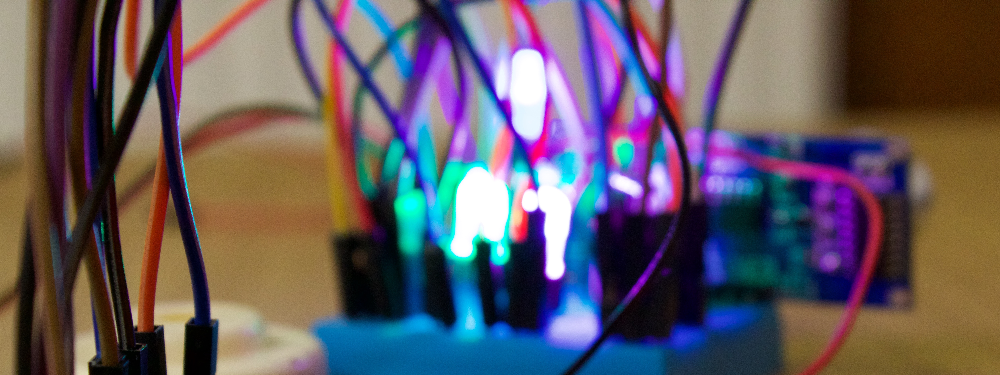
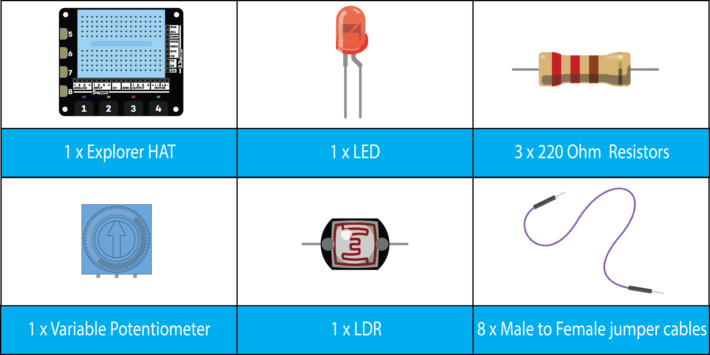
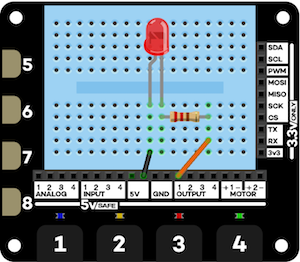
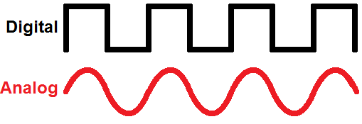
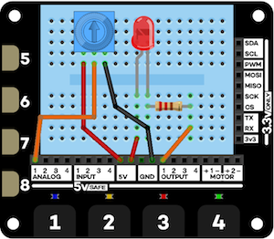

<h1 align="center" > Level 2 - Introduction to Electronics with Explorer HAT - Python</h1>


Although the Explorer HATs include some built in LEDs and buttons, they have a prototyping area where you can build your own mini circuits!   
This activity is an introduction to using 2 different electrical components with the Explorer HAT using its built in breadboard.
- LEDs
- Potentiometers 

## What you will need


<div class="page-break"></div>

### Attaching your Explorer HAT
If your Explorer HAT isn't already attached, nab a volunteer to give you a hand to attach it as it can be a fiddle.   
  

## LEDs
We are going to play with LEDs first. They come in lots of different colours, you don't have to use a red one for this activity.   
    
With 2 legged LEDs, the first important thing to know is the longer leg is the positive leg (anode) and the shorter leg is the negative leg (cathode).    
With our LED, we also need a resistor. Resistors come in thousands of different values for different applications. In our case, we need a 220 Ohm resistor (or 330 Ohm resistor).   
You can read the value of resistors using their coloured stripes.    
     
For example, the above resistor has red(2), red(2), brown(x10), gold(±5%).   
This means the resistor value is 220Ohms, but it could be ±5% which is perfect for us.   
The reason we need to use a resistor as it acts like a very small pipe, **limiting the electric current getting to the LED**, or else the LED might draw too much electrical current and explode!
   
### Wiring up
   
Using the breadboard on top of your Explorer HAT, wire up your circuit like above. The colour of wire you use doesn't matter.

### Opening up Python (IDLE)   
For this project we will be using Python 3. To start working in Python, open up IDLE3 by opening a terminal and typing ```sudo idle3 &```. Within a few seconds IDLE 3 should load up. Finally, click on file, new window and you are ready to go.

## Lets get coding!
At the start of each Python program for the Explorer HAT and Wizard, we need to import the Explorer HAT library, the network library and the time library (to allow us to use time.sleep()). To do that, we need to add this section to the start of each of our programs 
```python
import explorerhat as eh
import time
```   

<div class="page-break"></div>

Try the program below, what does it do?
```python
import explorerhat as eh
import time
eh.output.one.on()
time.sleep(1)
eh.output.one.off()
```  

### Challenges (LEDs)   
1. Now that you have your LED wired up and can turn it on and off. Why not try out a few other output functions available for ```eh.output.one.``` including `.toggle()`, `.blink( on_time, off_time )`, `.brightness( percentage )`. What do they do?
2. Why not try adding a second LED one in a different colour?  

## Potentiometers   
Potentiometers are basically variable resistors. As the Explorer HAT includes 4 analog inputs, we can use those to detect how far you have turned the potentiometer.   
### Digital vs Analog  
Digital inputs are extremely simple, they can either be on or off, 1 or 0. Analog inputs on the other hand can be on, off and everything in between!   
   
A potentiometer is an analog sensor while something like a button (which can either be pressed or not pressed) is a digital sensor.   

<div class="page-break"></div>

### Wiring up   
    
Using the breadboard on top of your Explorer HAT, wire up your circuit like above. The colour of wire you use doesn't matter.    
### Lets get coding!
```python
import explorerhat as eh
import time
print(eh.analog.one.read() * 20)
```  
The above code should simply print out onto the screen the value the analog input is reading from the potentiometer. It will be between 0 and 100.   
We can also do some more fancy stuff like called **Event driven programming**. This is where we tell the computer to trigger something when something happens.   
The Explorer Hat library includes ```eh.analog.one.changed(AwesomeFunctionName, sensitivity)``` function.   
It allows us to run a Python function when a set amount of a change in the sensor reading occurs.   

<div class="page-break"></div>

```python
import explorerhat as eh
import time

def toggleLED(event, channel):
  eh.output.one.toggle()
  print("Toggled!")

eh.analog.one.changed( toggleLED, 0.05 )
time.sleep(50)
```   
The above program should toggle your LED when you turn the potentiometer.   
    


Lets try one final example. Because you are using Python to do the measurements, you can take that data and plug it into another application. Lets try using the potentiometer with Minecraft!   
Open up Minecraft Pi and launch a new world. Then switch back to IDLE3 and add the below code.   

```python
import explorerhat as eh
import time
from mcpi.minecraft import Minecraft

mc = Minecraft.create()

def jump(event, channel):
  x, y, z = mc.player.getPos()
  y = y + (eh.analog.one.read() * 5)
  mc.player.setPos(x, y, z)
  print("Jump!!")

eh.touch.one.pressed( jump )
time.sleep(50)
```  

<div class="page-break"></div>

So lets have a look what is happening above.   
```python
import explorerhat as eh
import time
from mcpi.minecraft import Minecraft

mc = Minecraft.create()
```
This first part is very simple. Basically import all the libraries and open a connection to Minecraft.   

```python
def jump(event, channel):
  x, y, z = mc.player.getPos()   #Get players position
  y = y + (eh.analog.one.read() * 5)  #Get the potentiometer reading, multiple it by 5 then add the new value to y
  mc.player.setPos(x, y, z)    #Set the players position to these new coordinates
  print("Jump!!")
  ```
This section creates a **function** called jump. A function is used to teach Python how to do something, in this case, jump. It won't actually run the code, but will simply learn it. You can then tell it to run the code later by calling its name.     
Inside the function, we get the current players position (and store those in x, y, z), we then get the potentiometer value (and multiple it by 5 so is more useful), then add it to that to our current Y coordinates (height). We then set the players new position to these coordinates.   
```python
eh.touch.one.pressed( jump )  #Set up a handler with Python to trigger the jump function when pad one is touched.
time.sleep(50)  #Wait 50 seconds
```
Finally, we register a handler. A handler tells Python to keep an eye on if touch pad one is pressed and if it is, run jump.  We then just have a ```time.sleep(50)``` at the end so the program doesn't immediately finish.

<div class="page-break"></div>

### Challenges (Potentiometers)   
1. The example above lets you jump really high in Minecraft. What about a second function that triggers when you press the second pad that sends you underground instead?
2. Instead of teleporting you, how about placing a block (using ```mc.setBlock(x, y, z, 8)```) above you?
3. Using a second potentiometer, could you create a variable teleporter with the values from the first potentiometer for the X axis and the second potentiometer for the Y axis?
4. Now that you are an expert in using one type of analog sensor (potentiometer), why not try using the LDR (light sensor) instead. It is super simple to use and if you have any questions, ask a volunteer.   
