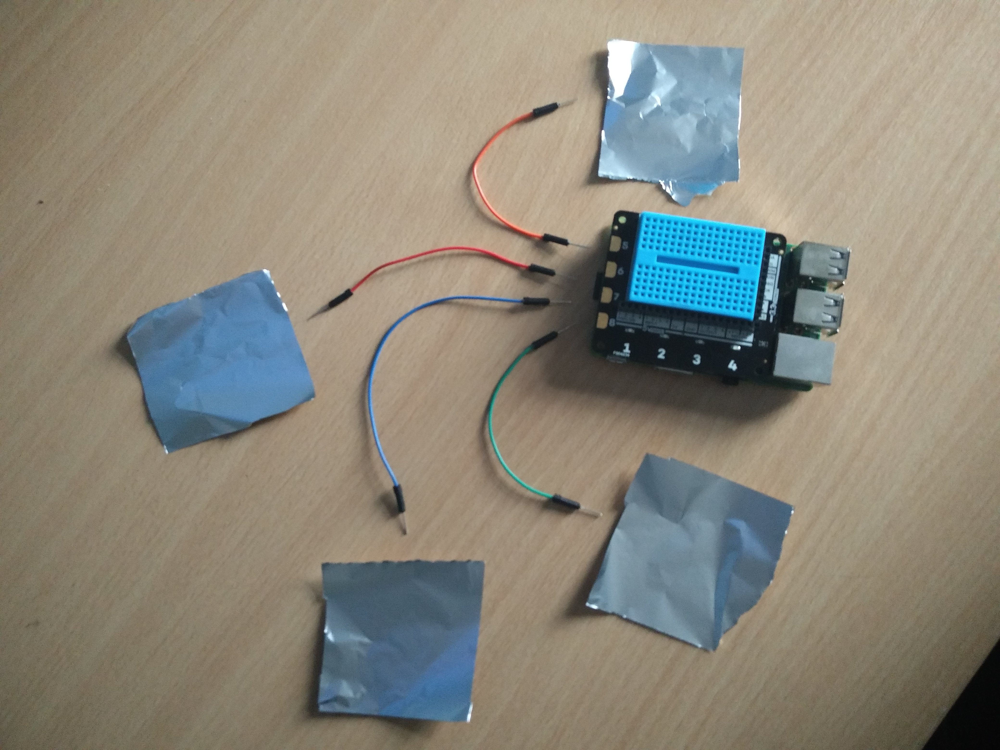

# Level 2 - Explorer HAT Music Box



## What will we being doing?
In this worksheet will be using the Explorer Hat with some tin foil to make a simple music box that will make sound clips play and the light of the Explorer Hat change colours.

## So what's a Explorer Hat?
A Explorer Hat is a add-on board for the Raspberry Pi that has 8 touch inputs, a small breadboard for you to prototype simple circuits on and 4 different coloured LEDs for you to play about and experiment with.

## What you're going to need!
- 1 Explorer hat
- 4 Crocodile clips
- 4 Pieces of tin foil
- 1 Pair of Headphones

<div class="page-break"></div>

## What are we going to do in this worksheet?
In this worksheet we will be using the Raspberry Pi with the Explorer Hat to first, trigger a led to turn on and off when you touch the tin foil that will be connected. Then we will move on to make different sounds play when you touch the different pieces of tin foil and as well make the lift flash.

## Attaching the Explorer Hat!


First of all, **Unplug the Raspberry Pi!** This is so if you plug in the Explorer Hat the wrong way you don't blow up a Raspberry Pi and create a puff of black smoke. When attaching you Explorer Hat remember to have the connector plugged in all the pins on the Raspberry Pi. When you have double checked that you have the pins connected properly then turn on you Raspberry Pi. **(Remember to plug in your headphones!)**

## Attaching the Tin Foil!


On the left hand side of the Explorer Hat there is a row of 4 gold pads. To connect your tin foil use one of the Crocodile clips to clip on to the one of the golden pads on the Explorer Hat and connect the other side of the crocodile clip to the tin foil. Do this 3 more times to connect to all 4 gold pads on the Explorer Hat. (**Tip Make sure the pieces of tin foil aren't touching!**)

## Opening the Python Editor!


Double click on what looks like a computer monitor on the task bar to open up the terminal. Then when the terminal up type in `sudo idle3` to open up IDLE 3. When IDLE is open for to **File** then click on **New File** to open up a editor to start coding.

## Testing the Explorer Hat
### Sensing when the Tin Foil is Touched

Before we begin having some fun playing sounds and flashing crazy light combinations, we need to make that the Explorer Hat is able to sense that we are touching the tin foil. So lets get on to testing that the Explorer Hat can sense us!

First we will need to says to the Pi that we need to use some building block to help us talk to the Explorer Hat. We can do this by adding `import explorerhat as eh` we are shortening explorerhat to eh so we are not tying the whole thing each time. So you code should look like

```Python
import explorerhat as eh
```

<div class="page-break"></div>


Now we have out building blocks down, we can move on to say what we are going to do when we get a touch. We will do this by making a `function` that will contain what we want to do when the tin foil is touched. We are going to call this function `if_touched` and we are going to make it `print` a message on screen  when we touch the tin foil.

```Python
def if_touched(channel, event):
    print("The tinfoil has been touched ;)")
```

Now that we are got a `function` that will do something when the when tin foil is touched, BUT... we need a way to be able to say to that function block that we have touched the tin foil. To do this we are going to use the building block we imported earlier. We are going to use `eh.touch.five.pressed(if_touched)` This says to the code when pad 5 if touched, run `if_touched`.

```Python
eh.touch.five.pressed(if_touched)
```

So now you code should look like this.

```Python
import explorerhat as eh

def if_touched(channel, event):
    print("The tinfoil has been touched ;)")

eh.touch.five.pressed(if_touched)
```

Now if you got to **file** then **save** you can save the file and then press **F58** you should be able to run the code. So now when you touch the piece of tin foil that is connected to the top left golden pad you should get the message on screen `The tinfoil has been touched ;)`. If you got the message, Great! move on to the next step!
