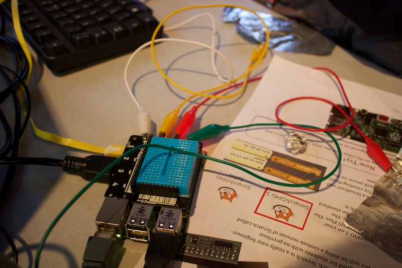

# NI Raspberry Jam activities   
    
   
As part of the Northern Ireland Raspberry Jam, we write a lot of our own activities.   
Although some of these activities may not be suitable for other Raspberry Jams, we have decided to upload them anyway. The main difference though with this section is the Markdown files used to create them are also included.   
Why should you care? Well it means you are free to edit and tweak them to your hearts content, making changes for your own Raspberry Jam, without needing to fiddle with hacking a PDF.   
All the resources also include their PDF, ready to print.   
    
For details on how we create our worksheets and export them as nicely rendered PDFs, see this [blog post](http://pi.gbaman.info/?p=548).
   
### Current activities
   
- [Explorer HAT Getting started (Scratch and Python) - Level 1](Explorer-HAT-Getting-started-Level1/)   
- [Traffic Explorer (Python) - Level 2](Traffic-Explorer-Level2/)    
