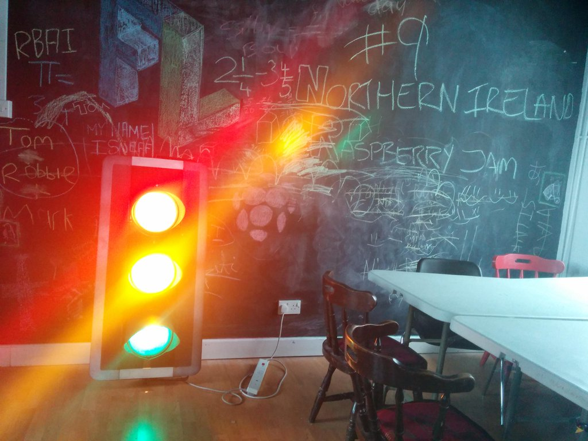
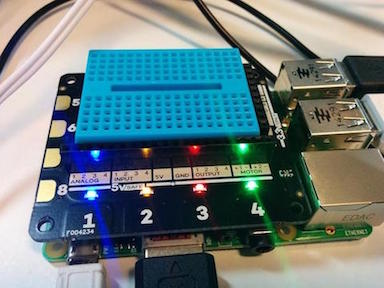

# Level 2 -  Traffic Explorer - Python
At Farset Labs, we have a traffic light! This traffic light (owned by Elen) is called Wizard and you can even follow it on Twitter! (@wizardsignal)  
Controlling Wizard is pretty simple using the network.py library, but what if we could control the traffic light from something like an Explorer HAT?   


## What you will need
 - x1 Explorer Pro HAT (Hardware Attachment on Top).
 - x4 crocodile clips.
 - Some tinfoil or other conductive material (fruit, playdough etc).

<div class="page-break"></div>

### Attaching your Explorer HAT
If your Explorer HAT isn't already attached, nab a volunteer to give you a hand to attach it as it can be a fiddle.   
    

### Opening up Python (IDLE)   
For this project we will be using Python 3. To start working in Python, open up IDLE3 by opening a terminal and typing ```sudo idle3 &```. Within a few seconds IDLE 3 should load up. Finally, click on file, new window and you are ready to go.

# Lets get coding!
### Code setup
At the start of each Python program for the Explorer HAT and Wizard, we need to import the Explorer HAT library, the network library and the time library (to allow us to use time.sleep()). To do that, we need to add this section to the start of each of our programs   
```python
import explorerhat as eh
import time
import network
```   

<div class="page-break"></div>
    
## Controlling the traffic light
To control the traffic light is actually super simple.    
1. First, bring in our libraries
```python
import explorerhat as eh
import time
import network
```   

2. We now need to define the IP address of the traffic light and make a connection to it. Remember to change the address below to the correct one (usually on the blackboard, if in doubt ask a volunteer).   
```python
ipaddress = "10.83.3.100"
network.call(ipaddress)
```

3. Now that we have made a connection, we need to send it messages. We use the command below to send messages to whatever device we have connected to in the section above.   
```python
network.say("RedOn")
```
You can change "RedOn" in the above line of code to any of the possible commands below.   

| Command | What it does |
| ------------- | ------------- |
| GreenOn | Turns green light on. |
| GreenOff | Turns green light off. |
| AmberOn | Turns amber light on. |
| AmberOff | Turns amber light off. |
| RedOn |  Turns red light on.|
| RedOff | Turns red light off. |
| AllOn | Turns all 3 lights on. |
| AllOff | Turns all 3 lights off. |    
   
Once you have got your code running a single command, it is time to start combining them to create a sequence (or a program). To do this, we will use multiple ```network.say()``` commands and will make use of ```time.sleep(1)```, a simple way to add pauses/waits into your program.   
The command ```time.sleep(2)``` will pause the program for 2 seconds.   

### Challenges (part 1)
Now you are an expert in controlling the traffic light directly with your Python code and sequencing, can you...?
1. Create a green, amber, red sequence.
2.  Create the full traffic light sequence.

## Combining this with the Explorer HAT
Now that you are an expert in controlling the Wizard the traffic light, it is time to move onto controlling it using the Explorer HAT.   
This section builds on what you have learnt from the Level One Python activity (*Level 1 -  Explorer HAT Introduction - Python*).   
   
Lets dive right in. Remember, to detect a touch pad being pressed, we must first define a function for it to run when we a press is detected, for example   
```python
import explorerhat as eh
import time

def awesome_function(channel, event):
  network.say("RedOn")
  time.sleep(1)
  network.say("RedOff")

eh.touch.one.pressed( awesome_function )
```   

### Challenges (part 2)
1. Can you combine your previous full traffic light program with one of the touch inputs, so when you press it, the traffic light runs through the standard traffic light sequence?
2. Can you build a system using x6 capacitive touch inputs on the Explorer HAT to control each bulb of the traffic light individually? Include ability to turn on and off.  
