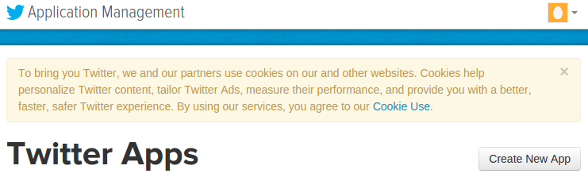
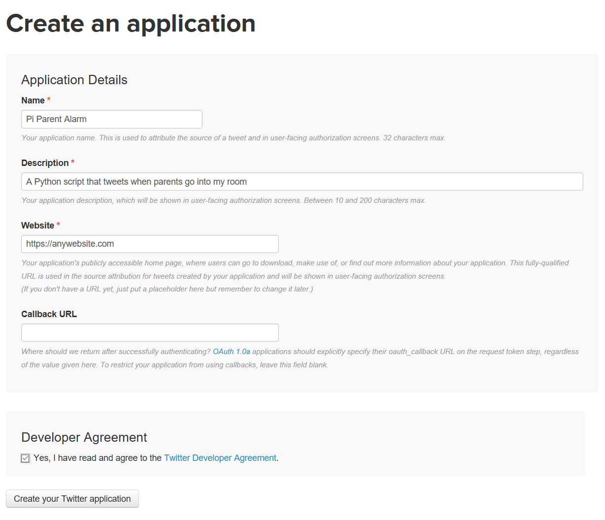
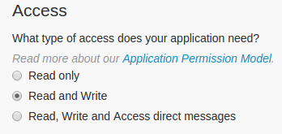
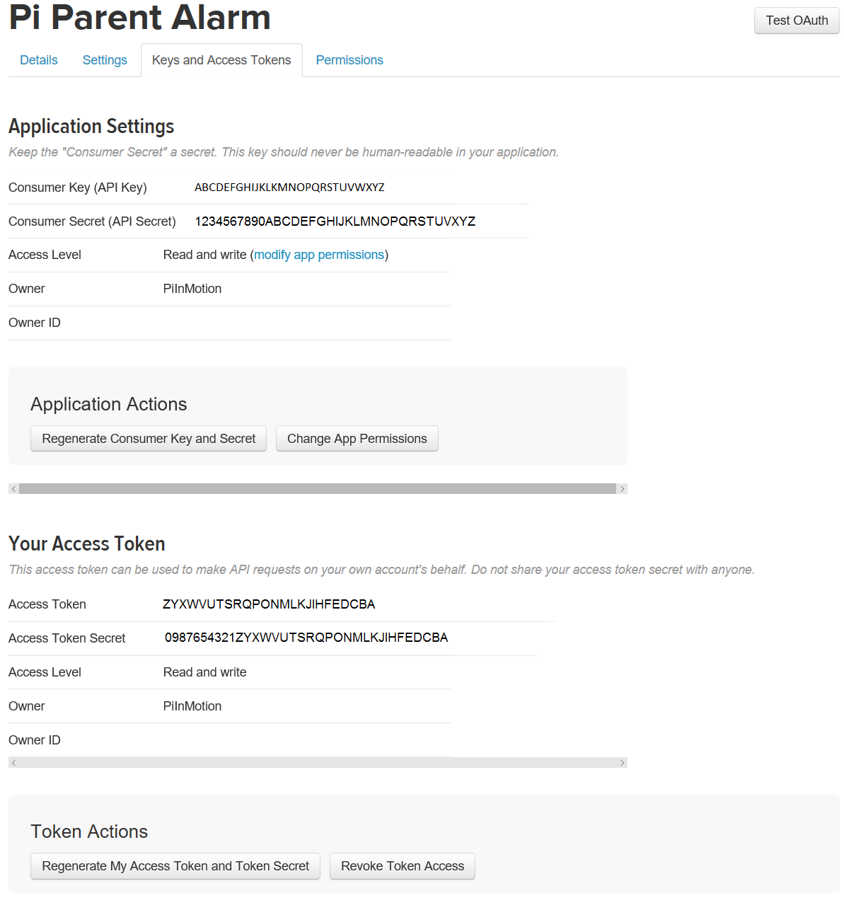
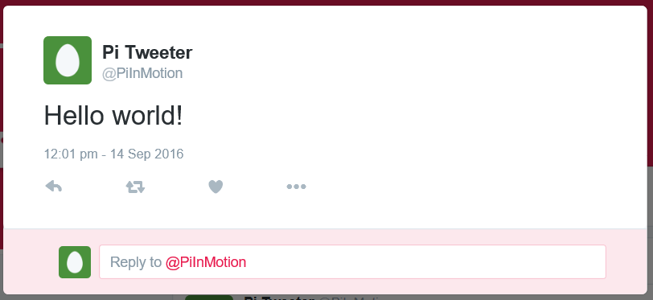
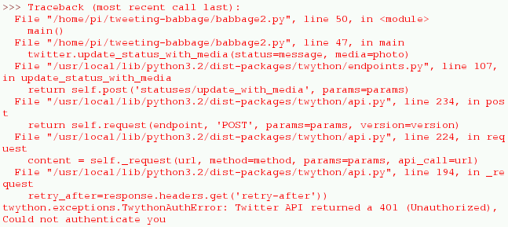
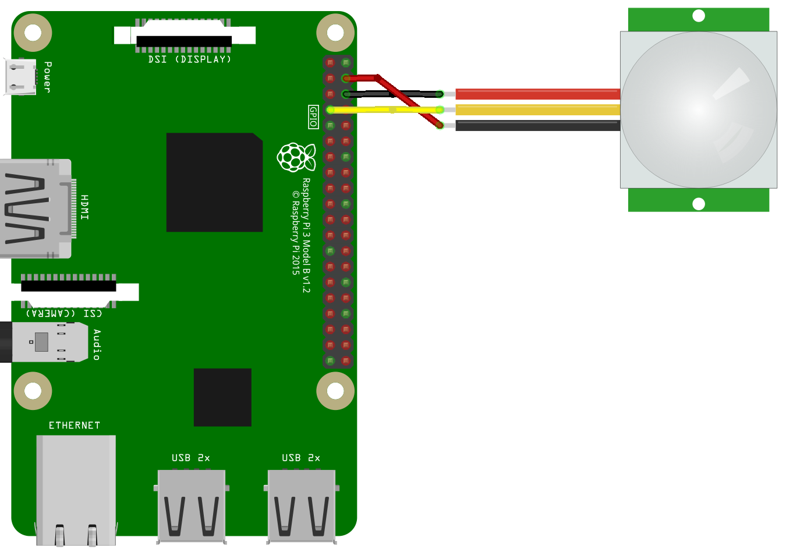

# Raspberry Pi Twitter Motion Photo Booth


## Introduction
Have you ever left your room to go out, just to come back and get told off by your parents because "your room is too messy" and to "tidy it up"? Everyone has... but how did your parents find out that your room was in a bad state at the start? They of course, like every parent, snuck into your room.

Well, let's make a device that will make your parents think twice before they decide to step into your messy kingdom; we will do this by calling them out! Through posting a picture onto Twitter when your Raspberry Pi detects motion.

## How do we detect motion?

To detect motion we are going to use a PIR (Passive Infra-Red) sensor. This little sensor can be found in a number of places, for example, a motion detector light that is installed on the outside of houses' to turn on the light when someone is there.

## Getting the Twitter API
Before we start wiring up and using our PIR to spot our parents, we need to make a twitter account (if you don't have one). Then we're going to link your twitter account to the Raspberry Pi so that we can have your piece of code talk to Twitter to upload your picture.

## Create a Twitter account

If you don't already have a Twitter account, you'll need to create one.

1. Create a Twitter account by going to **https://twitter.com**.

    

2. You will also need to setup a phone number with Twitter as verification, to be able to use the Twitter API that we need to use.

You might also want to upload a photo and fill out the bio to personalise your account.

## Create a Twitter application

You need to register your application (that is this worksheet) with Twitter to get the keys. These allow you to access your Twitter account from Python using the Twitter API (Application Programming Interface).

1. Go to **https://apps.twitter.com** and click the **Create New App** button.

    

<div class="page-break"></div>

2. Complete the application details form. You must enter an application name, description, and website (this can be `https://www.raspberrypi.org/` if you don't have one). Leave the 'Callback URL' field blank and proceed.

    

3. Modify your app permissions from **Read only** to **Read and write**.

    

4. Click the 'Keys and Access Tokens' tab and create an access token.

5. Once you've clicked the **Create an Access Token** button, refresh the page and you will see a new section beneath the **Application Settings** with your access token details.

<div class="page-break"></div>

6. You should now be able to see your **Consumer key**, **Consumer secret**, **Access token**, and **Access token secret**. You'll need these four keys to connect to your Twitter account from your Python code. Don't share these keys with anyone, as they can be used without the account's password. If you share your code online, make sure not to include these keys.

  

Now that we have the authentication codes for Twitter, we can now move on to testing that our keys are right and sending our first tweet for our Pi.

## Opening the Python Editor!


Double click on what looks like a computer monitor on the task bar to open up the terminal. Then when the terminal up type in `sudo idle3 &` to open up IDLE 3.

## Send a tweet from Python

Now you have your API keys, and IDLE3 open we can start coding. You're ready to send a tweet from Python!

1. First we need to open a file, so go to `File` then click on `New File`.

2. Create a new file and paste your API keys from **https://apps.twitter.com** into variables, like so:

    ```python
    consumer_key        = 'ABCDEFGHIJKLKMNOPQRSTUVWXYZ'
    consumer_secret     = '1234567890ABCDEFGHIJKLMNOPQRSTUVXYZ'
    access_token        = 'ZYXWVUTSRQPONMLKJIHFEDCBA'
    access_token_secret = '0987654321ZYXWVUTSRQPONMLKJIHFEDCBA'
    ```

3. To save the file, go to `File` then click on `Save` and name the file **auth.py** and click on `save`.

4. Now we need to create a new file, so go to `File` and click on `New File`.

5. Create another new file and import `Twython` from the `twython` module:

    ```python
    from twython import Twython
    ```

6. Also, import the variables from `auth.py`:

    ```python
    from auth import (
        consumer_key,
        consumer_secret,
        access_token,
        access_token_secret
    )
    ```

7. Make a connection with the Twitter API using this set of keys:

    ```python
    twitter = Twython(
        consumer_key,
        consumer_secret,
        access_token,
        access_token_secret
    )
    ```

8. Start with a basic "Hello world" tweet to test the connection works:

    ```python
    message = "Hello World!"
    twitter.update_status(status=message)
    print ("Tweeted: ", message)
    ```

    This uses the API's `update_status()` function to send a tweet containing the text "Hello World!" That is defined when we use `message = "Hello World!"`.

9. Now save the file by going to `File` then click on `Save` then name the file `message.py` and click on `save`.

10. Now we can run the file by go to `Run` then clicking on `Run`. You should see the message "Tweeted: Hello world!". Go to your Twitter profile in a web browser to verify it was sent! This will be at `twitter.com/username`, where `username` is your Twitter account's username.

  

<div class="page-break"></div>

  **Note** that sending multiple tweets with the exact same text are classed as duplicates and rejected by Twitter. If you want to test it again, try tweeting a different message.

  If you see an error, your API keys may be incorrect. Be sure to copy them exactly and check the spelling of the variables. You should also check that your Pi is connected to the internet.

  

## Wiring Up the Raspberry Pi!
Now that we have finished setting up and testing the Twitter API in Python, we can start wiring up the PIR sensor the Raspberry Pi and getting the camera installed.

But first **Unplug the Raspberry PI from power!** If you don't you _will_ break the Raspberry Pi when plugging in the PIR sensor or the attaching the Raspberry Pi Camera Module.

1.  Connecting the PIR

    We will now wire up the PIR sensor to the Raspberry Pi using female to female jumper cables corresponding to the table below,

| PIR pin        | Pi GPIO Pin    |
| :------------- | :------------- |
| GND            | GND(Pin 6)     |
| Signal         | GPIO Pin 7     |
| 5V Power       | 5V(Pin 4)      |



2.  Connecting the Camera
    To connect the camera, lift up the connector latch between the HDMI and audio jack and place the Raspberry Pi Camera Module's ribbon cable in with the blue tab facing towards the Ethernet port of the Raspberry Pi.

    

    After you have finished, connect your PIR sensor and the Camera Module. Double check that they are connected properly before plugging your Raspberry Pi back in so you don't blow anything up! Well, maybe an exaggeration. But you *could* end up with a Pi that's giving off black smoke. (Best to avoid this.)

<div class="page-break"></div>

## Making our Raspberry Pi tweet a picture.

1. First we need to open a new file, so go to `File` then click on `New File`.

2. Now that we have a new file opened we can start by importing all the packages we need to make tweeting a picture work. Along with `Twython` we also need to import `sleep` , `PiCamera` , `RPi.GPIO` and time and date.

    ```python
    from twython import Twython
    from picamera import PiCamera
    import RPi.GPIO as GPIO
    from time import sleep
    from datetime import datetime
    ```

3. Now we also need to import the variables from `auth.py` back in.

    ```python
    from auth import (
        consumer_key,
        consumer_secret,
        access_token,
        access_token_secret
    )
    ```

4. Then we'll make a connection with the Twitter API using this set of keys we just imported:

    ```python
    twitter = Twython(
        consumer_key,
        consumer_secret,
        access_token,
        access_token_secret
    )
    ```

5. After we need to setup our inputs from the Raspberry Pi's GPIO so the Pi knows we are using the PIR as a input for our code.

    ```python
    PIR = 7
    GPIO.setmode(GPIO.BOARD)
    GPIO.setup(PIR, GPIO.IN)
    ```

6. Now let's set up the message we are going to send without picture. In this case I have chosen to use the message `Hello World!` but if you want you can use your own message.

    ```python
    message = "Hello world!"
    ```
7. Now we are going to state that `camera` refers to `PiCamera()` in the code.

    ```python
    camera = PiCamera()
    ```
8. After this we want to start a `while loop` so all the code will keep repeating.

    ```python
    while True:
    ```

9. Now we are going to make it so that we can taking in a input from a PIR then do something after the PIR sends the PI a trigger.

    ```python
		if GPIO.input(PIR):
	  ```

10. Now we need to make the Pi remember the time and date when the PIR is triggered so we can name the file with the time and date. In between the speech marks we will define the pathway to where we want the image to be stored.

    ```python
    timestamp = datetime.now().isoformat()
    photo_path = '/home/pi/tweeter/%s.jpg' % timestamp
    ```

11. After we tell the code where we want the image to be stored and what name to give it, we need to `sleep` the code. Then we need to make the Raspberry Pi take a picture from the camera module.

    ```python
    sleep(2)
    camera.capture(photo_path)
    ```

12. After taking making the code that will take the picture we need to start writing the code that will actually post the image to Twitter. So we are going to start with the section of code that will define what image we are going to post.

<div class="page-break"></div>

```python
with open(photo_path, 'rb') as photo:
```

By using `photo_path` we are referring to the name that we set for the image that is going to be taken by the Pi, which in this case is made from getting the time and date that the picture was taken at.

13. We will need to make a bit of code that will make a `response` to say that we are going to open a picture in Twitter API.

    ```python
    response = twitter.upload_media(media=photo)
    ```

14. Now that we have told the Twitter API where to get the image we have taken we can now write the line that will actually post the code to Twitter.

    ```python
    twitter.update_status(status=message, media_ids=[response['media_id']])
    ```

    In this line we are sending a status update to Twitter. `status=message` is referring to the status that we want to post with. The image is the `message` we defined earlier. `media_ids=[response['media_id']]` is saying to get the image that we stated in the line before and post it with the message.

15. Now we are going to add 2 lines to say that we have posted the picture with the image, and to exit the script so we aren't uploading repeat status up to twitter.

      ```python
      print("just tweeted", message , "with the image", photo_path)
      exit()
      ```

16. Now save the file by going to `File` then click on `Save`, then name the file `picture.py` and click on `save`.

17. Now we can run the file by going to `Run` then clicking on `Run`. You should see the message "Just tweeted (your message) with the image (Name of image)". If you got no errors you should be able to see the image and along with your message on your Twitter profile!
