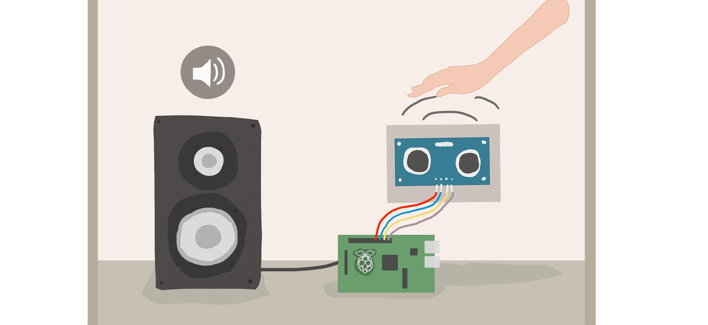
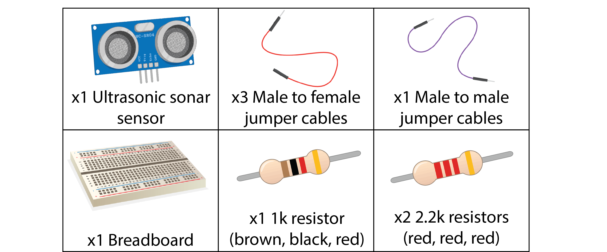
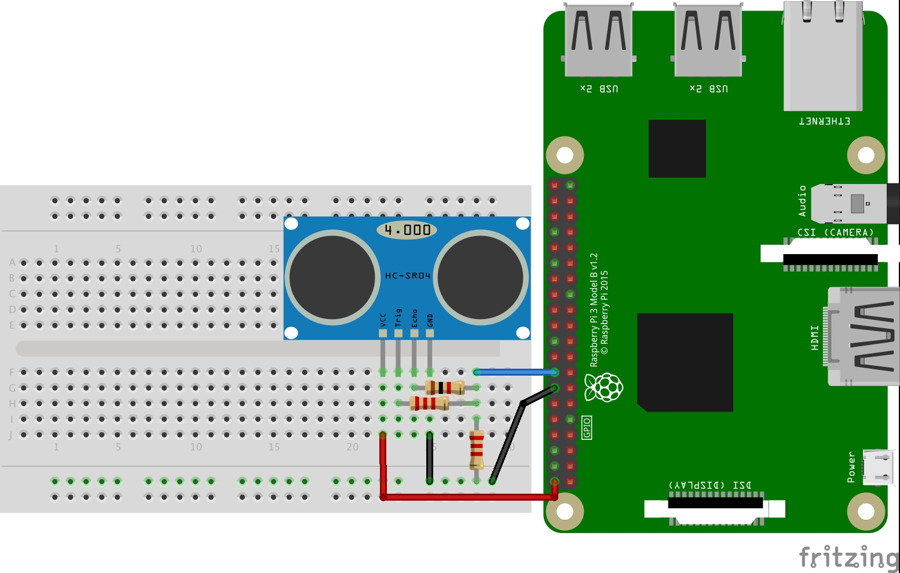
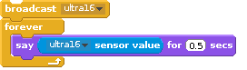
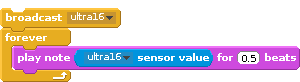

# Ultrasonic Theremin

In this activity, you will learn to create your own theremin (musical instrument) using an ultrasonic sonar sensor and Scratch!   
A theremin is a digital music instrument that was invented back in 1920 by a Russian inventor called Léon Theremin.
With it, you can create music with only the movement of your hand in the air!    
### What you will need


<div class="page-break" />

## Wiring

The wiring for this project is a little complicated. Make sure to take your time with it as it is very easy to make mistakes.      
  
**IMPORTANT** - Make sure your Raspberry Pi has its USB (power) cable unplugged when wiring up the sensor. When finished, ask a volunteer to check your circuit before plugging it back in again.  
    
With this circuit, we are using the resistors to form what is called a "voltage divider". A voltage divider does just as its name suggests, divides the voltage coming through it. It is needed as we are sending 5v to the sensor, but the max the Raspberry Pi can receive back is only 3.3v.   

<div class="page-break" />

## Programming
### Opening and setting up Scratch

For this activity, we will be using Scratch GPIO.
Go to the Pi's desktop and open ScratchGPIO7, if it isn't there try and click the Install ScratchGPIO7 icon, after a moment ScratchGPIO7 should appear on the desktop. When you open ScratchGPIO7, a pop-up window should say Remote sensor connections enabled.   
   
With ScratchGPIO open, we need to inform it we want to use an Ultrasonic sonar sensor. Create a new broadcast with word "ultra16" in it (as our sensor is connected to pin 16).   
If you double click this block, ScratchGPIO now knows to every second, ping the ultrasonic sonar sensor to get the distance of an object in front of it.   
If you then want to get the actual distance, you need to use the ```sensor value``` block in the ```Sensing``` section.    
The ```sensor value``` block will have the ```ultra16``` option. You can use this to get the distance objects are away from the ultrasonic sensor in cm.    

### Using an ultrasonic sonar sensor    
The sensor is able to measure distances up to 1.5m. Sonar involves sending a "blip" of sound out from the sensor, then counting how long it takes for the echo to be detected again by the receiver.    
Ultrasonic works great against flat surfaces, but curved surfaces cause the echo to get scattered. As such, **flat surfaces (like a book etc) work great, while other surfaces (like a face or hand) may not work as well**, or produce as accurate a result.  

### Adding music   
Scratch includes the super easy to use ```play note``` block. You can use it in combination with your ```ultra16 sensor value``` block to play music based on the distance from the sensor.  
   
You may find the range of notes doesn't exactly work for the type of music you want to use a maths block from the ```operators```section to multiply/divide the ```ultra16``` value.   

## Now try   
1. Can you add a way to change the volume of the music as well? Perhaps use a keyboard press or mouse clicks to select a lower or higher volume?     
2. Could you integrate the ultrasonic sensor in with another Scratch program you have worked on previously? Perhaps use it to control a character on screen or to be used in special puzzles?   
3. Can you create a simple copy of the famous "Space Invaders" game, using the ultrasonic sensors to control the back and forth of the ship?   
