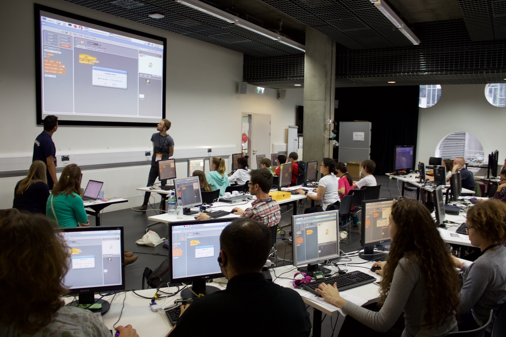

# Mozilla Festival 2015 Resources

As part of the Mozilla Festival (Mozfest), an army of volunteers from the Raspberry Pi community ran 15 workshops in the YouthZone.        

## Resources   
All the resources used can be found below followed by the session leader who submitted it. Note that many of these resources are based off previous resources developed by the Raspberry Pi Foundation.   
- [Astro Pi - Your code in space](Worksheets/Mozfest2015/AstroPi.pdf?raw=true) - [Raspberry Pi Foundation](https://twitter.com/Raspberry_Pi)
- [Musical fruit with the Explorer HAT](Worksheets/Mozfest2015/Explorer-Fruit.pdf?raw=true) - [Jim Darby](https://twitter.com/HackerJimbo)
- [Scratch-ing the surface of space](Worksheets/Mozfest2015/Scratch-ing-surface-of-space.pdf?raw=true) - [Milton De Paula](https://twitter.com/miltonio94) and [Connor Ballard](https://twitter.com/connorbanona)
- [Hacking Minecraft Pi with Python](Worksheets/Mozfest2015/Hacking-Minecraft-With-Python-Castles.pdf?raw=true) - [Joseph Thomas](https://twitter.com/jthomascoop), [Zachary Igielman](https://twitter.com/ZacharyIgielman) and [Yasmin Bey](https://twitter.com/RPi_Yaz14)
- [Flappy AstroPi](Worksheets/Mozfest2015/Flappy-Astronaut.pdf?raw=true) - [Frank Hockey](https://twitter.com/fth_nix)
- [Scratch-ing the Surface with GPIO](Worksheets/Mozfest2015/Scratch-ing-the-surface-GPIO.pdf?raw=true) - [Cat Lamin](https://twitter.com/CatLamin)
- [Astronaut reaction times](Worksheets/Mozfest2015/Astronaut-reaction-times.pdf?raw=true) - [Andrew Mulholland](https://twitter.com/gbaman1)

---
 Unless otherwise stated, all work in this repository is licensed under a <a rel="license" href="http://creativecommons.org/licenses/by-sa/4.0/">Creative Commons Attribution-ShareAlike 4.0 International License</a>.
